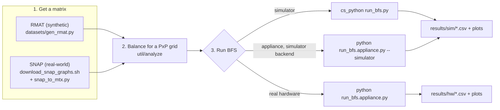

# CereGraphs

Graph BFS on the Cerebras Wafer-Scale Engine (WSE-3): a boolean-semiring
SpMV kernel (`y = OR_j (A[i,j] AND x[j])`) with diagonal-targeted
broadcast/reduce (via the SDK's `<collectives_2d>` stdlib), run iteratively
and entirely on-device — frontier propagation, a cumulative visited set,
termination detection, and parent tracking, with no host round trip between
rounds.

## Layout

- **`bfs/`** — the kernel and everything that drives it:
  - `bfs/implementation/` — the CSL kernel (`src/layout_bool.csl`,
    `src/bool_pe.csl`, `src/collectives_2d/`) and host code (`device_io.py`, `graph_loader.py`,
    `preprocess_bool.py`, `bfs_timing.py`).
  - `bfs/scripts/` — every runnable entrypoint: `run_bfs.py` (simulator),
    `run_bfs.appliance.py` (real ALCF appliance hardware or its simulator
    backend), `run_graph500.py` (the full Graph500-shaped multi-search
    benchmark), plus the shell sweep/slurm scripts around them.
  - `bfs/plots/` — plotting code only (per-run timing charts, tree
    comparison, balancing before/after, scale x grid heatmaps).
  - `bfs/results/` — every output artifact (CSV logs, PNG/SVG plots) the
    scripts above generate. Gitignored and fully regenerable — nothing
    here needs to survive a fresh clone.
- **`data/`** — input matrices (Matrix Market format, 1-based): synthetic
  RMAT/GRAPH500-style graphs and real-world SNAP graphs, both regenerable
  (see `datasets/`).
- **`datasets/`** — matrix generation and acquisition: `gen_rmat.py`
  (synthetic RMAT), `download_snap_graphs.sh` + `snap_to_mtx.py` +
  `prep_snap.sh` (real-world SNAP graphs — download, convert, balance).
- **`util/`** — `analyze.cpp`, a load-balancing tool: given a matrix and a
  PE grid shape, finds a row/column permutation minimizing the variance of
  nonzeros per PE block. A native binary, not committed to git — run `make
  -C util` after every fresh clone (every script that calls
  `util/analyze` does this itself already).
- **`docs/`** — design/methodology notes that don't belong in this README:
  `GRAPH500_BENCHMARK.md` (what "the BFS time" means, TEPS methodology),
  `COLLECTIVES_TOPOLOGY.md` (`<collectives_2d>`'s actual wire topology),
  `ERRORS.md` (real-hardware error compendium).

## Running a BFS end to end

Three stages, always in this order: get a matrix, balance it for the PE
grid you'll run on, then run BFS.



### 1. Get a matrix

Synthetic RMAT (GRAPH500-style, `A=.57 B=.19 C=.19 D=.05`):

```sh
cs_python datasets/gen_rmat.py <scale> <edgefactor> <seed> data/rmat_s<scale>_e<edgefactor>.mtx
# e.g. a ~2M-vertex graph:
cs_python datasets/gen_rmat.py 21 16 0 data/rmat_s21_e16.mtx
```

Real-world SNAP graph — either the individual steps:

```sh
datasets/download_snap_graphs.sh berkstan        # -> data/snap/web-BerkStan.txt.gz
cs_python datasets/snap_to_mtx.py data/snap/web-BerkStan.txt.gz data/snap_berkstan.mtx
```

or the whole download+convert+balance pipeline for all seven bundled graphs
at once (skips a graph if its files already exist):

```sh
datasets/prep_snap.sh 750   # 750 = PE grid size to balance for
```

### 2. Balance it for a PE grid

```sh
make -C util   # util/analyze is a native binary, not committed -- build once per clone

./util/analyze --matrix data/rmat_s21_e16.mtx --symmetric \
    --fabx 750 --faby 750 \
    --omatrix data/rmat_s21_e16.balanced750x750.mtx \
    --operm data/rmat_s21_e16.balanced750x750.operm
```

`--symmetric` fabricates structural symmetry (only correct for a genuinely
undirected graph); `--shared-perm` balances a directed graph without that
assumption. See `datasets/prep_snap.sh` for which SNAP graphs are which.

Optionally check the balancing actually helped:

```sh
cs_python bfs/plots/plot_balance_before_after.py \
    --raw=data/rmat_s21_e16.mtx \
    --balanced=data/rmat_s21_e16.balanced750x750.mtx --grid=750
# -> bfs/results/balancing/rmat_s21_e16/sparsity_750x750.svg
```

### 3. Run BFS

Simulator — local, no cluster access needed:

```sh
cs_python bfs/scripts/run_bfs.py --arch=wse3 \
    --num_pe_cols=750 --num_pe_rows=750 --channels=16 \
    --infile_mtx=data/rmat_s21_e16.balanced750x750.mtx --source=0 \
    --latestlink bfs/out/s21_750x750
# -> bfs/results/sim/bfs_timing.csv + tree/timing plots
```

Real ALCF appliance hardware — two phases, compile then run (add
`--simulator` to both calls to validate the same code path against the
cluster's software stack first, without spending a real hardware
allocation):

```sh
source <path-to-your-cerebras-appliance-sdk-venv>/bin/activate
export no_proxy="10.125.8.2,.cerebras.internal,localhost,127.0.0.1"
export NO_PROXY="$no_proxy"

python bfs/scripts/run_bfs.appliance.py --infile_mtx=data/rmat_s21_e16.balanced750x750.mtx \
    --num_pe_cols=750 --num_pe_rows=750 --channels=16 --source=0 --arch=wse3 \
    --notree --compile-only
python bfs/scripts/run_bfs.appliance.py --infile_mtx=data/rmat_s21_e16.balanced750x750.mtx \
    --num_pe_cols=750 --num_pe_rows=750 --channels=16 --source=0 --arch=wse3 \
    --notree --csv=bfs/results/hw/bfs_timing.csv \
    --out-timing=bfs/results/hw/timing/timing_rmat_s21_e16.balanced750x750_750x750_src0_ch16.png
```

Or drive the whole loop above for a batch of (scale, edgefactor, grid)
cases at once via `bfs/scripts/sweep_bfs.sh` (edit its `CASES` array
first):

```sh
./bfs/scripts/sweep_bfs.sh                # simulator
./bfs/scripts/sweep_bfs.sh appliance-sim  # appliance client, simulator backend
./bfs/scripts/sweep_bfs.sh appliance      # real hardware
```

`run_bfs.py`/`run_bfs.appliance.py` both require a **square PE grid**
(`--num_pe_cols == --num_pe_rows`) and a **square matrix** — see
`bfs/README.md` for why. For the full Graph500-shaped multi-search
benchmark (harmonic-mean GTEPS across many roots) instead of one
single-source run, use `bfs/scripts/run_graph500.py` the same way.

## Quick start notes

`cslc`/`cs_python` run inside a container that only binds the *invocation's
current directory* — a path that reaches outside it (e.g. `../data/...`) is
invisible even though it exists on disk. Every command above is written to
run from this repo root, with matrix paths relative to it (`data/...`, not
`../data/...`).

`util/analyze` is a plain native binary (not containerized), so it has no
such restriction — run it from anywhere with ordinary relative paths.
